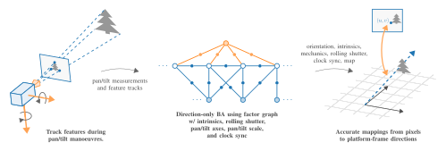

#### Paper submitted to IEEE Transactions on Robotics
### Achieving Sub-Pixel Platform Accuracy with Pan-Tilt-Zoom Cameras in Uncertain Times
Authors: **M. V. Larsen**, K. Mathiassen (martin-vonheim.larsen (a) ffi.no)

&nbsp;[](https://pypi.python.org/pypi/b2)

In this paper, we present a novel method for self-calibrating a pan-tilt-zoom
(PTZ) camera system model, specifically suited for long-range multi-target
tracking with manoeuvring low-cost PTZ cameras. Traditionally, such camera
systems cannot provide accurate mappings from pixels to directions in the
platform frame due to imprecise pan/tilt measurements or lacking
synchronisation between the pan/tilt unit and the video stream.  Using a
direction-only bundle adjustment (BA) incorporating pan/tilt measurements, we
calibrate camera intrinsics, rolling shutter (RS) characteristics and
pan/tilt mechanics and obtain clock-synchronisation between the video stream
and pan/tilt telemetry. In a thorough simulation study, we show that the
proposed estimation scheme identifies model parameters with sub-pixel
precision across a wide range of camera setups. Leveraging the map of
landmarks from the BA, we propose a method for estimating camera orientation
in real-time, and demonstrate pixel-level mapping precision on real-world
data. Through the proposed calibration and orientation schemes, we enable
high-precision target tracking during camera manoeuvres in many low-cost
systems, which was previously reserved for high-end systems with specialised
hardware.



The full paper can be found at **TBA**.

The [ptcee](../../../ptcee)
library contains the code needed for performing the direction-only bundle
adjustment (BA) used in the paper.  This repository contains the additional
code needed to perform the Monte Carlo (MC) simulation from section V.A in the
paper.

### Reproducing the simulated experiments
Running the simulations and generating the results takes 20 - 60 min, depending
on what HW you are using. We recommend building using Docker, as this will be
straight-forward on most machines. If you want to adjust parameters or modify
the code we recommend following the manual approach.

<details>
  <summary>Generate results using Docker</summary>

Make sure to have [Docker](https://www.docker.com/) installed.

```bash
docker build -t ptcee-paper .

docker run --rm -v $(pwd)/results:/root/results ptcee-paper /bin/bash -c "cd /root/results \
         && /root/build/hard_beta_mc $(nproc) 10000 hard-beta-mc.dat \
         && /root/build/soft_beta_mc $(nproc) 10000 soft-beta-mc.dat \
         && python /root/Paper-ptz-subpix-accuracy/python/print-tables.py hard-beta-mc.dat soft-beta-mc.dat > tables.txt \
         && python /root/Paper-ptz-subpix-accuracy/python/generate-plots.py hard-beta-mc.dat soft-beta-mc.dat"
```
The `results` directory should now contain the following files:
- `tables.txt` (with table II and III as raw text)
- `hard-beta-f-hist.pdf` (fig 6.a)
- `hard-beta-k-hist.pdf` (fig 6.b)
- `hard-beta-d-hist.pdf` (fig 6.c)
- `hard-beta-ell-hist.pdf` (fig 6.d)
- `hard-beta-mepe-hist.pdf` (fig 7)
- `soft-beta-rel-f-err.pdf` (fig 8)
</details>
<details>
  <summary>Build and generate results manually</summary>
The following instructions are intended to work on Ubuntu 22.04, but should
work on your operating system of choice. Make sure to use Python 3 and a
fairly recent compiler (GCC >= 8).

<details>
  <summary>Step 1: Install GCC, Python 3 as default, CMake and Git</summary>

```bash
[sudo] apt update
[sudo] apt install build-essential python3-pip python-is-python3 cmake
```
</details> 

<details>
  <summary>Step 2: Setup conan</summary>

If you haven't already, head over to [conan.io](conan.io) and follow updated
install instructions from there.

At the time of writing, the following gets you setup:
```bash
pip install conan
conan profile new $HOME/.conan/profiles/default --detect
conan profile update settings.compiler.libcxx=libstdc++11 default
```
</details> 

<details>
  <summary>Step 3: Download and export ptcee</summary>

```bash
cd /tmp
git clone https://github.com/marvonlar/ptcee.git /tmp
conan export /tmp/ptcee
rm -rf /tmp/ptcee
```
</details> 

<details>
  <summary>Step 4: Build</summary>

```bash
git clone https://github.com/marvonlar/Paper-ptz-subpix-accuracy.git
cd Paper-ptz-subpix-accuracy
conan install . -if=build -bmissing
cd build
cmake .. -DCMAKE_BUILD_TYPE=RELEASE
cmake --build . -- -j$(nproc)
cd ..
```
</details> 

<details>
  <summary>Step 5: Generate results</summary>

```bash
build/hard_beta_mc $(nproc) 10000 hard-beta-mc.dat
build/soft_beta_mc $(nproc) 10000 soft-beta-mc.dat

pip install -r python/requirements.txt

python python/print-tables.py hard-beta-mc.dat soft-beta-mc.dat
# prints table 2 and 3 and NMEPEs
python python/generate-plots.py hard-beta-mc.dat soft-beta-mc.dat
# generates fig 6.a as hard-beta-f-hist.pdf
#           fig 6.b as hard-beta-k-hist.pdf
#           fig 6.c as hard-beta-d-hist.pdf
#           fig 6.d as hard-beta-ell-hist.pdf
#           fig 7   as hard-beta-mepe-hist.pdf
#           fig 8   as soft-beta-rel-f-err.pdf
```
</details> 
</details> 

## License

Source code is licensed under the [MIT
License](https://opensource.org/licenses/MIT). See [LICENSE](LICENSE).

### Citation

Please cite the Paper as:

**TBA**

Bibtex entry as follows:

**TBA**
